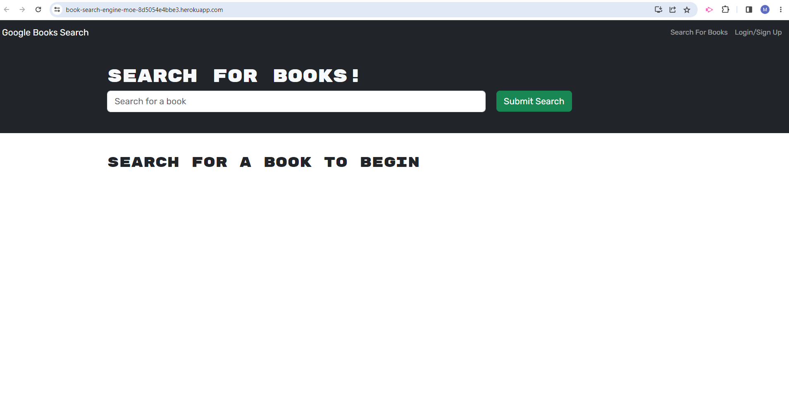
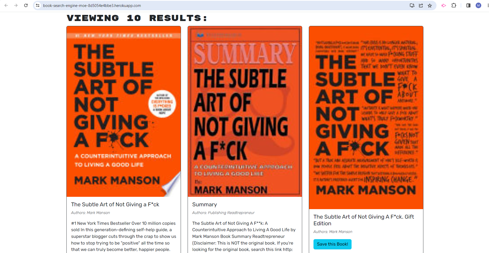
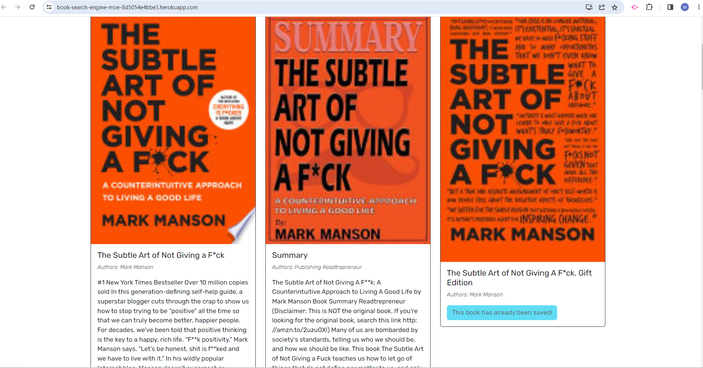
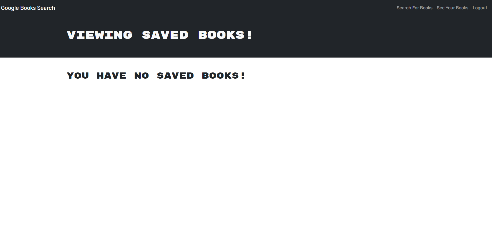
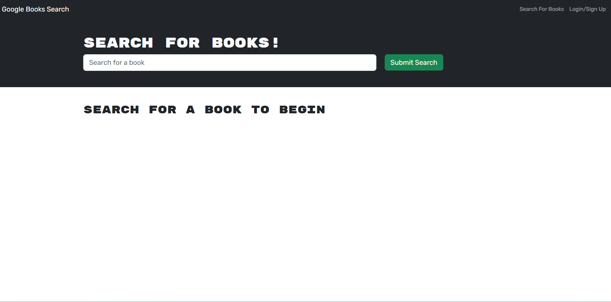

# book-search-engine

## Discription

this is my 21th assignment and it was converting the book search engine from RESTful API to GraphQL API,

in this 21th assignment  i started with a given code 

-my motivation was to practice what i learned in the bootcamp untill Jun 26- 2023

-the problem i experinced is building the right mutations and queries, refactoring the code to work with GraphQL API, and deploying the app to heroku, and use the right packages to make the app work with GraphQL API, and i solved it by using the right packages and refactoring the code to work with GraphQL API, and make the delete book feature work i realtime , and deploying the app to heroku, and use the right packages to make the app work with GraphQL API, and i used the tutor session to solve the problem i faced.

## used technologies

- REACT, GetQL, Apollo, Node.js, Express.js, MongoDB, Heroku, Bootstrap, CSS, HTML, JavaScript, Git, GitHub, VS Code, Google Chrome, and Google.

## github 
https://github.com/melhelow/book-search-engine

## deployed
https://book-search-engine-moe-8d5054e4bbe3.herokuapp.com/

## credits

bootcamp,tutor session

## License

please refer to the MIT license in the repo